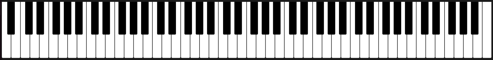

# jack-midi-tools
Jack Midi client applications to use for music creation. It started as a hobby project where the goal is to use midi events to alter visual animations.

- Contains an easier to use API for creating jack modules. Hiding most of the complexity so module developers can concentrate on what they want to implement.
  - Currently only midi-in has been implemented. Other ports and transport between ports will be added when needed.
- Minimal example for logging midi inputs has been added. It logs any raw midi event to the terminal/console.

## Midi device

`midi-device` is a rust library to keep track of the state of a midi device.

## Midi events

`midi-events` is a rust library that contains data types for parsing and using midi.

## Music notes

`music-notes` is a rust library containing data types for music in general. It has been setup to be not specific to western music only. Although currently only a generic layer and the chromatic scale have been implemented it can be easily extended to support other scales as well.

## EGUI Widgets for music

### Piano Keys

Widget to draw a piano. Has options to use different colors when keys are pressed.

Still in development, here is a short list containing improvements.
- [ ] Use different width for black keys.
- [ ] Add spacing and offset between black keys.
- [ ] Reserve layout space in egui.